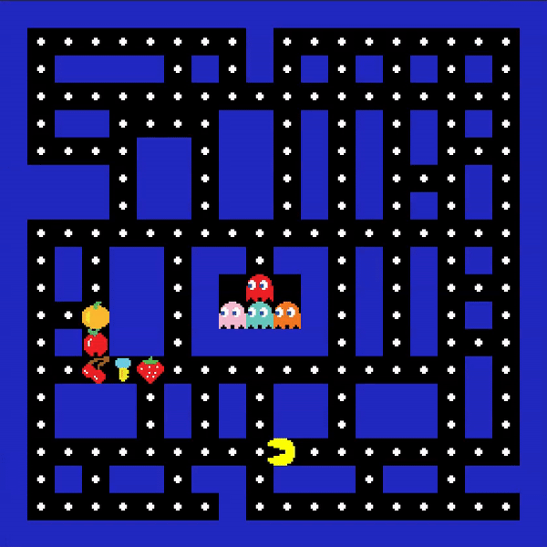
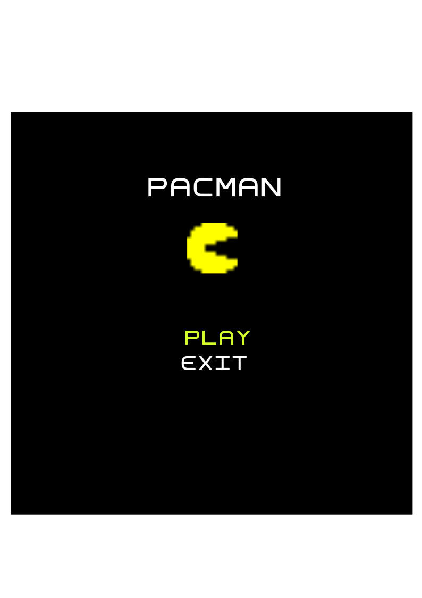

<h1 align="center">LDTS_10_03 - Pacman</h1>

**Pacman** is a text-based adaptation of the classic *Pacman* game, developed using Java and the **Lanterna** library.
In this game, players control Pacman through an arena, collecting coins, power-ups and avoiding pursuit by the iconic
ghosts: Blinky, Pinky, Inky, and Clyde. With a simple interface, the goal is to recreate the
nostalgia of the original game while exploring the SOLID principales and design-patterns.

<h3 align="center">Gameplay examples</h3>

    

<h3 align="center">Mockups</h3>

    
    

This project was developed by <a href="https://github.com/GustavoCMadureira">Gustavo Madureira</a> (up202304978@fe.up.pt), <a href="https://github.com/PauloSaa29">Paulo Saavedra</a> (up202307477@fe.up.pt) and <a href="https://github.com/peucastro">Pedro Castro</a> (up202200044@fe.up.pt) for the LDTS 2024/25 course at FEUP.

