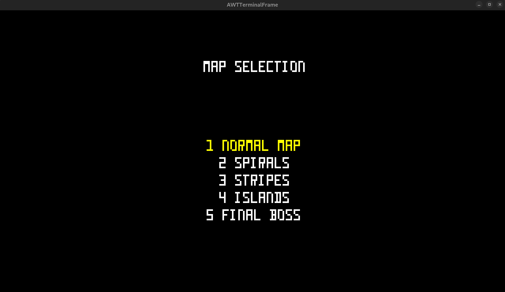

# LDTS_T10_G03 - **PACMAN**

## Game description

**Pacman** is a text-based adaptation of the classic *Pacman* game, developed using Java and the **Lanterna** library.
In this game, players control Pacman through an arena, collecting coins, power-ups and avoiding pursuit by the iconic
ghosts: Blinky, Pinky, Inky, and Clyde. With a simple interface, the goal is to recreate the
nostalgia of the original game while exploring the SOLID principals and design-patterns.
For a more detailed version of this description click [here](./docs/README.md).

### Game demonstration

  

  <b><i>Gif 1. Single player demonstration</i></b>

 

  

  <b><i>Gif 2. Multiplayer demonstration</i></b>

 

### Menus

  

  <b><i>Gif 3. Main menu</i></b>

 

  

  <b><i>Fig 1. Pause menu</i></b>

 

  

  <b><i>Fig 2. Map selection</i></b>

 

### Levels

  

  <b><i>Gif 4. Spirals</i></b>

 

  

  <b><i>Gif 5. Final boss</i></b>

 

### End game

  

  <b><i>Fig 3. Win message</i></b>

 

  

  <b><i>Fig 4. Lost message</i></b>

 

---

This project was developed by <a href="https://github.com/GustavoCMadureira">Gustavo Madureira</a> (up202304978@fe.up.pt), <a href="https://github.com/PauloSaa29">Paulo Saavedra</a> (up202307477@fe.up.pt) and <a href="https://github.com/peucastro">Pedro Castro</a> (up202200044@fe.up.pt) for the LDTS 2024/25 course at FEUP.

