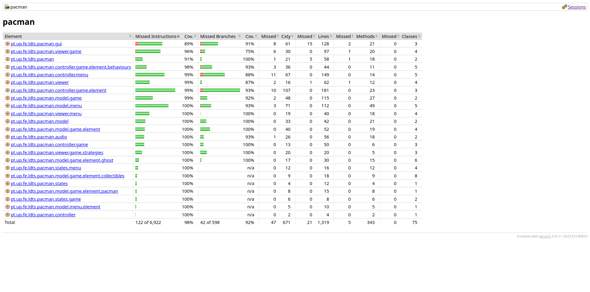

# LDTS_T10_G03 - **PACMAN**

## Game description

In this project, we developed a Pacman clone using **Java** and the **Lanterna** library, offering a text-based,
retro-style gaming experience. The player controls Pacman, navigating through an arena, collecting coins and power-ups,
all while avoiding four unique ghosts: Blinky, Pinky, Inky, and Clyde. The game is designed to be simple yet
challenging, and it implements various object-oriented design patterns to ensure maintainability and scalability.

This project was developed by <a href="https://github.com/GustavoCMadureira">Gustavo Madureira</a> (
up202304978@fe.up.pt), <a href="https://github.com/PauloSaa29">Paulo Saavedra</a> (up202307477@fe.up.pt)
and <a href="https://github.com/peucastro">Pedro Castro</a> (up202200044@fe.up.pt) for the LDTS 2024/25 course at FEUP.

## Implemented features

- **Player Character (Pacman):** The player controls Pacman, which can move in four directions. Pacman interacts with
  the game environment, including collecting coins and evading ghosts.
- **Ghosts:** Each ghost will have a unique behavior to challenge the player. Ghosts adapt to the player’s movements,
  creating a dynamic and engaging chase.
- **Coins and Power-ups:** Collectible items that increase the player’s score. The game ends when all coins are
  consumed.
- **Start and pause menus:** The user has the capability of pause and return to the main menu during the gameplay.
- **Alert menus:** When the user wins or loses, a custom message shows up at the window.
- **Map selection:** A total of 5 maps are available to play, each with unique layouts and challenges.
- **Multiplayer mode:** For each map, the user has the capability of playing it the singleplayer or multiplayer
  mode. In multiplayer mode, a second player can control another Pacman character, adding an extra layer of excitement
  and teamwork.
- **Audio:** A lively soundtrack plays during gameplay. Interactive sound effects include audio cues for collectible
  consumption, menu navigation, and player actions such as losing a life.
- **Resizable screen:** The game offers a resizable screen feature, allowing players to adjust the game window for
  their preferred viewing experience.

## Planned features

- **Power-ups:** Special collectible items that temporarily change the Pacman state.

## **Implementation Overview**

The system is composed of the following key components:

- **Element:** A base class representing both movable (Pacman, Ghosts) and static (coins, power-ups) elements in
  the game.
- **MovableElement & StaticElement:** Interfaces defining the behavior of objects that can move or remain stationary.
- **Pacman & Ghost:** Concrete classes that implement the movable behavior, with the Ghost class further divided into
  specific ghost types (Blinky, Pinky, Inky, Clyde).
- **Direction & Position:** Representations of the directions and coordinates in the game world.
- **Arena:** A container for all the elements in the game, including Pacman, ghosts, and collectible items.

## Design

### **Design Pattern Descriptions**

#### **Model-View-Controller (MVC)**

- **Problem in Context:**  
  The game requires a clear separation of concerns to ensure modularity and scalability. Before adopting MVC, game
  logic, rendering, and user interactions were tightly coupled, making the codebase difficult to maintain or extend. For
  instance, changes to the game state often required modifying rendering logic, and vice versa.

- **The Pattern:**  
  MVC was chosen to decouple the game's data (Model), user interface (View), and control logic (Controller). This
  ensures that changes in one layer do not directly impact the others, making the system more maintainable and
  extensible.

- **Implementation:**  
  The **Model** encapsulates the game's data and logic. (e.g., `Pacman`, `Ghost`, `Coins`). The **View** is responsible
  for rendering these elements on the screen using classes like `PacmanViewer` and `GhostViewer`. The **Controller**
  manages user input and updates the game state accordingly, e.g., `GameController` handles key presses and game loop
  logic.

- **Consequences:**
    - **Benefits:** Modular design, easier testing, and flexibility in extending individual components (e.g., adding new
      views or input mechanisms).
    - **Liabilities:** Initial complexity in designing the system and increased communication overhead between
      components.

- **Code References:**

- [Pacman Model](/src/main/java/pt/up/fe/ldts/pacman/model/game/element/pacman/Pacman.java)
- [Pacman Viewer](/src/main/java/pt/up/fe/ldts/pacman/viewer/game/MovableElementViewer.java)
- [Pacman Controller](/src/main/java/pt/up/fe/ldts/pacman/controller/game/element/pacman/PacmanController.java)

- **UML diagram:**
  // TODO

#### **Game Loop**

- **Problem in Context:**  
  The game needed a consistent and efficient way to update the state and render frames. Initially, updates and rendering
  were triggered ad-hoc, leading to performance issues and inconsistent behavior.

- **The Pattern:**  
  The **Game Loop** pattern was implemented to provide a centralized mechanism for updating the game state and rendering
  frames at a consistent rate. It ensures smooth gameplay and predictable frame timings.

- **Implementation:**  
  The `GameLoop` class encapsulates the loop logic, running at a fixed frame rate of 60 FPS.

- **Consequences:**
    - **Benefits:** Smooth and predictable game behavior, centralized control of game timing.
    - **Liabilities:** May require optimization for complex games to avoid frame drops.

- **Code References:**

- [Game Loop Implementation](/src/main/java/pt/up/fe/ldts/pacman/Game.java)

- **UML diagram:**
  // TODO

#### **Singleton**

- **Problem in Context:**  
  The `Game` and `AudioManager` classes must have a single shared instance throughout the game's lifecycle. Multiple
  instances would lead to inconsistent behavior and resource conflicts (e.g., overlapping music tracks).

- **The Pattern:**  
  The **Singleton** pattern was applied to enforce a single instance of `Game` and `AudioManager`. It provides global
  access points and ensures controlled instantiation.

- **Implementation:**  
  Both `Game` and `AudioManager` use a private constructor and a static `getInstance` method. This ensures that only one
  instance is created and shared.

- **Consequences:**
    - **Benefits:** Centralized resource management, reduced risk of conflicts.
    - **Liabilities:** Limited flexibility in testing (mocking requires additional effort).

- **Code References:**

- [Game Singleton](/src/main/java/pt/up/fe/ldts/pacman/Game.java)
- [AudioManager Singleton](/src/main/java/pt/up/fe/ldts/pacman/audio/AudioManager.java)

- **UML diagram:**  
  // TODO

#### **State**

- **Problem in Context:**  
  The game has multiple states, such as menus, gameplay, and win/lose screens, each with distinct behavior.

- **The Pattern:**  
  The **State** pattern was selected to encapsulate state-specific behavior in separate classes, enabling seamless
  transitions between states and simplifying the `Game` class.

- **Implementation:**  
  The `State` abstract class defines common behaviors, while concrete implementations like `MainMenuState` and
  `GameState` handle state-specific logic. Transitions are managed via the `setState` method in `Game`.

- **Consequences:**
    - **Benefits:** Cleaner state management, easier to add or modify states.
    - **Liabilities:** Increased number of classes.
    -
- **Code References:**

- [State Abstract Class](/src/main/java/pt/up/fe/ldts/pacman/states/State.java)
- [MainMenuState](/src/main/java/pt/up/fe/ldts/pacman/states/menu/MainMenuState.java)

- **UML diagram:**  
  // TODO

#### **Strategy**

- **Problem in Context:**  
  Different entities (e.g., `Ghost`, `MovableElementViewer`) require distinct but interchangeable behaviors, such as
  movement logic or rendering strategies. Before applying **Strategy**, these behaviors were hard-coded, leading to
  rigid designs.

- **The Pattern:**  
  The **Strategy** pattern allows defining interchangeable behaviors, making it easy to extend or modify functionality
  without altering existing code.

- **Implementation:**  
  `GhostController` and `MultipleElementViewer` use the Strategy pattern to encapsulate behavior. For instance,
  `GhostController` implements specific movement logic as strategies.

- **Consequences:**
    - **Benefits:** Flexibility in adding new behaviors, reduced code duplication.
    - **Liabilities:** Slightly increased complexity due to additional interfaces/classes.

- **Code References:**

- [GhostController Strategies](./src/controller/GhostController.java)

- **UML diagram:**  
  // TODO

#### **Facade**

- **Problem in Context:**  
  The `LanternaGUI` library involves complex setup and interaction processes, which are cumbersome to use directly
  throughout the game.

- **The Pattern:**  
  The **Facade** pattern simplifies interactions with `LanternaGUI` by providing a unified interface through the
  `LanternaGUI` class.

- **Implementation:**  
  `LanternaGUI` wraps around the library’s complexities, exposing only the necessary methods for rendering and input
  handling.

- **Consequences:**
    - **Benefits:** Simplified API for GUI operations, improved code readability.
    - **Liabilities:** Limited flexibility for advanced users needing direct access to the library.

Code References:

- [LanternaGUI Facade](/src/main/java/pt/up/fe/ldts/pacman/gui/LanternaGUI.java)

- **UML diagram:**  
  // TODO

#### **Factory**

- **Problem in Context:**  
  The game requires the creation of various viewers (e.g., `PacmanViewer`, `GhostViewer`) depending on the specific
  element. Manually instantiating these viewers scattered the logic and made it error-prone.

- **The Pattern:**  
  The **Factory** pattern centralizes the creation logic for viewers, ensuring consistent and correct instantiation.

- **Implementation:**  
  The `ViewerFactory` class provides methods to create instances of `Viewer` based on the specific game element.

- **Consequences:**
    - **Benefits:** Centralized instantiation logic, improved maintainability.
    - **Liabilities:** Minor overhead in managing the factory class.

- **Code References:**

- [Viewer Factory](/src/main/java/pt/up/fe/ldts/pacman/viewer/ViewerFactory.java)

- **UML diagram:**  
  // TODO

---

## **UML schema**

  

  <b><i>Fig 5. UML classes diagram</i></b>

## Known-code smells

We have fixed all the errors reported by error-prone. No other major code smells identified.

## Testing

We used unit testing with Junit 5, mocks with Mockito, mutation testing with Pitest, test coverage verification with
jacoco and property based testing with jqwik.

### Screenshot of Test Coverage

  

  <b><i>Fig 6. Code coverage screenshot</i></b>

  

  <b><i>Fig 7. Mutation coverage screenshot</i></b>

