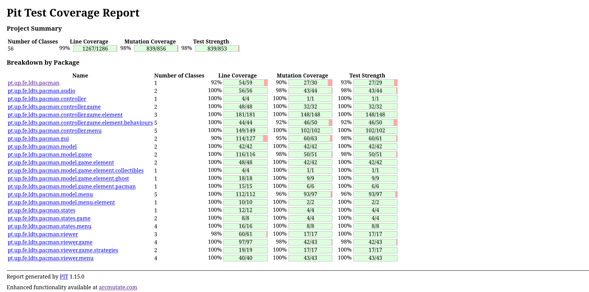

# LDTS_T10_G03 - **PACMAN**

## Game description

In this project, we developed a Pacman clone using **Java** and the **Lanterna** library, offering a text-based,
retro-style gaming experience. The player controls Pacman, navigating through an arena, collecting coins and power-ups,
all while avoiding four unique ghosts: Blinky, Pinky, Inky, and Clyde. The game is designed to be simple yet
challenging, and it implements various object-oriented design patterns to ensure maintainability and scalability.

This project was developed by <a href="https://github.com/GustavoCMadureira">Gustavo Madureira</a> (
up202304978@fe.up.pt), <a href="https://github.com/PauloSaa29">Paulo Saavedra</a> (up202307477@fe.up.pt)
and <a href="https://github.com/peucastro">Pedro Castro</a> (up202200044@fe.up.pt) for the LDTS 2024/25 course at FEUP.

## Implemented features

- **Player Character (Pacman)**: The player controls Pacman, which can move in four directions. Pacman interacts with
  the game environment, including collecting coins and evading ghosts.
- **Ghosts**: Each ghost will have a unique behavior to challenge the player. Ghosts adapt to the player’s movements,
  creating a dynamic and engaging chase.
- **Coins and Power-ups**: Collectible items that increase the player’s score. The game ends when all coins are
  consumed.
- **Start and pause menus** - The user has the capability of pause and return to the main menu during the gameplay.
- **Alert menus** - When the user wins or loses, a custom message shows up at the window.
- **Map selection** - A total of 5 maps are available to play, each with unique layouts and challenges.
- **Multiplayer mode** - For each map, the user has the capability of playing it the singleplayer or multiplayer
  mode. In multiplayer mode, a second player can control another Pacman character, adding an extra layer of excitement
  and teamwork.
- **Audio** - A lively soundtrack plays during gameplay. Interactive sound effects include audio cues for collectible
  consumption, menu navigation, and player actions such as losing a life.
- **Resizable screen** - The game offers a resizable screen feature, allowing players to adjust the game window for
  their preferred viewing experience.

## Planned features

- **Power-ups**: Special collectible items that temporarily change the Pacman state.

## **Implementation Overview**

The system is composed of the following key components:

- **Element**: A base class representing both movable (Pacman, Ghosts) and static (coins, power-ups) elements in
  the game.
- **MovableElement & StaticElement**: Interfaces defining the behavior of objects that can move or remain stationary.
- **Pacman & Ghost**: Concrete classes that implement the movable behavior, with the Ghost class further divided into
  specific ghost types (Blinky, Pinky, Inky, Clyde).
- **Direction & Position**: Representations of the directions and coordinates in the game world.
- **Arena**: A container for all the elements in the game, including Pacman, ghosts, and collectible items.

## Design patterns used

### **MVC** (Model-view-controller)

**Problem Context:** We needed a structured way to organize the game logic, user interactions, and visual representation
to ensure modularity and separation of concerns in the project.

**Solution:** We implemented the MVC design pattern. The `Model` represents the game state and logic, the `View` handles
rendering the game elements, and the `Controller` manages user inputs and updates the game state. This approach ensures
that changes in one layer (e.g., the user interface) don't directly affect the others.

- **Model:** Encapsulates the game elements like Pacman, ghosts, collectibles, and their interactions.
- **View:** Uses the Lanterna library to render the game elements on the console.
- **Controller:** Interprets user inputs and updates the model accordingly.

**Classes Involved:**

- **Model:** `Position`, `Pacman`, `Ghost`, `Arena`, `ArenaLoader`, `Collectible`, `Direction`, ...
- **View:** `ArenaViewer`, `ElementViewer`, `Display`, ...
- **Controller:** Yet to be implemented

## **UML schema**

  

  <b><i>Fig 5. UML classes diagram</i></b>

## Known-code smells

We have fixed all the errors reported by error-prone. No other major code smells identified.

## Testing

We used unit testing with Junit 5, mocks with Mockito, mutation testing with Pitest, test coverage verification with
jacoco and property based testing with jqwik.

### Screenshot of Test Coverage

  

  <b><i>Fig 6. Code coverage screenshot</i></b>

  

  <b><i>Fig 7. Mutation coverage screenshot</i></b>

### Link to mutation testing report

[Mutation tests](/build/reports/pitest/index.html)
